# MEDICHAIN - Blockchain Powered EMR sharing and storage.

This project was bootstrapped with [Create React App](https://github.com/facebook/create-react-app).

## Details of system

## 1. System architecture

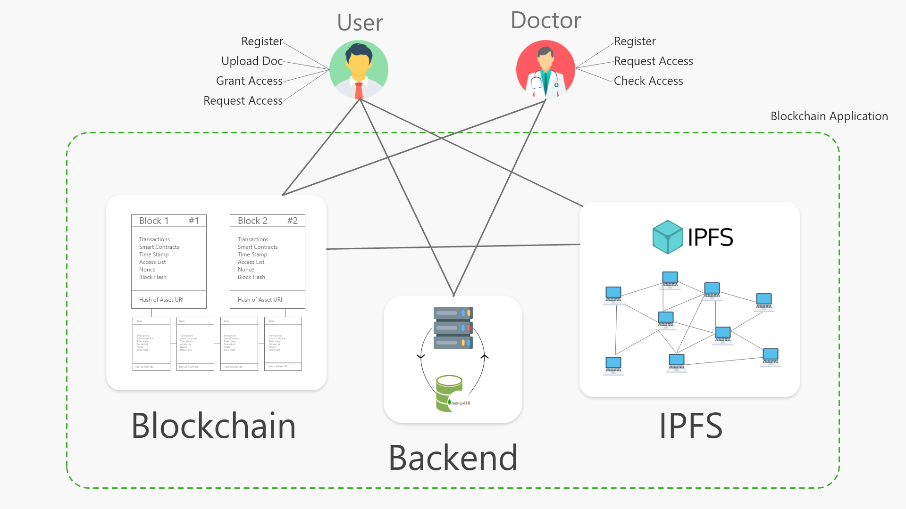

## 2. User Sequence Diagram

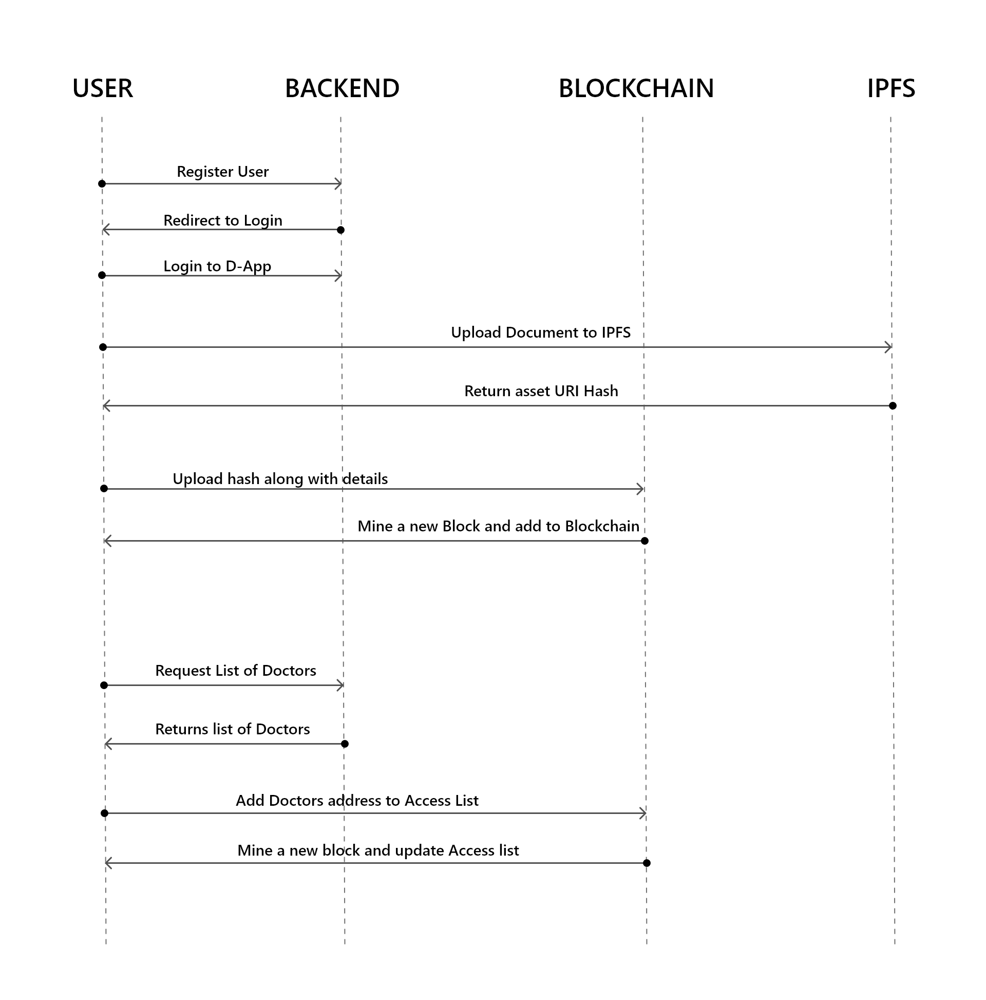

## 1. Doctor Sequence Diagram

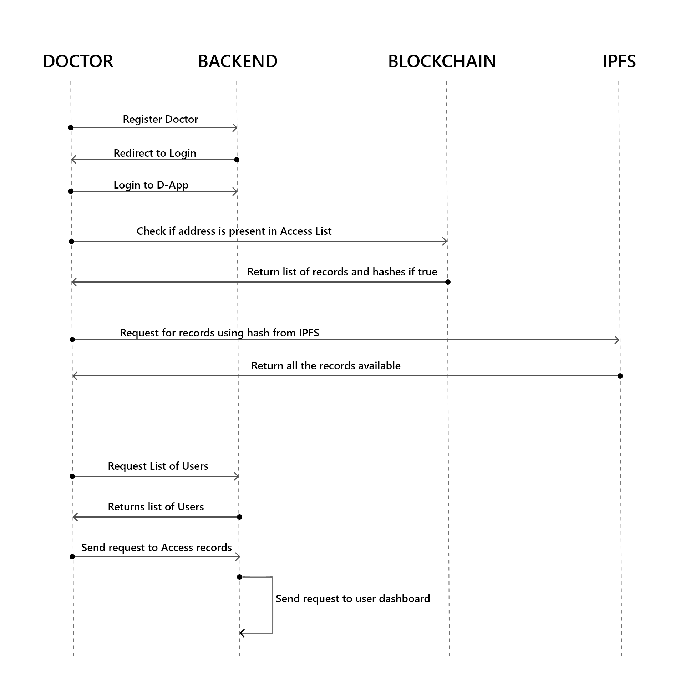

## Working ScreenShots

## 1. Home Page

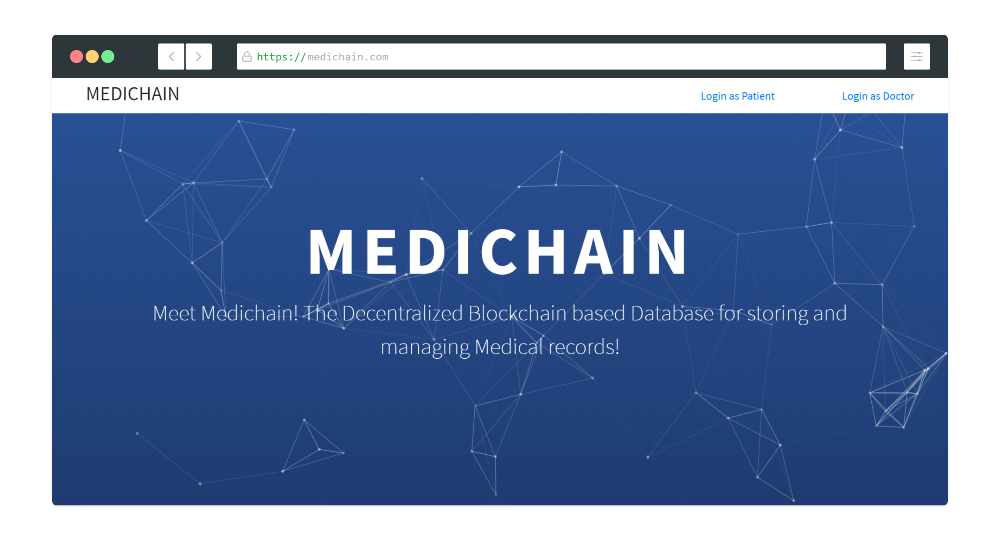

## 2. User Signup

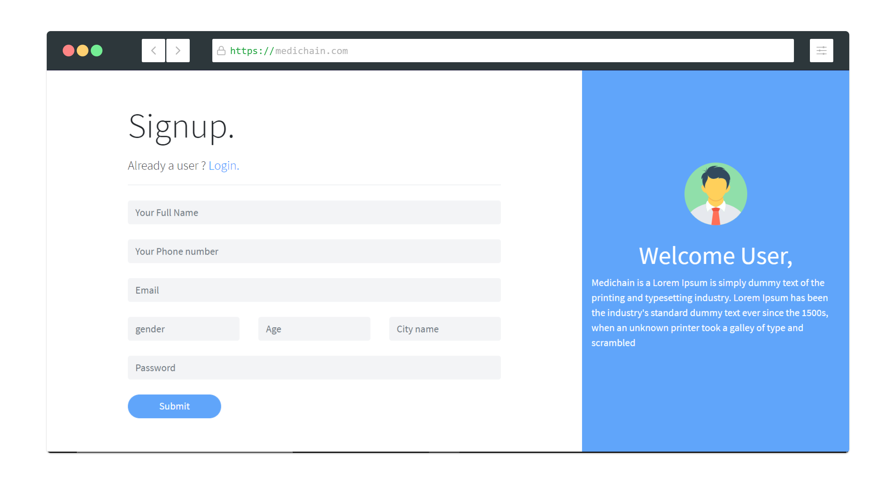

## 3. User DashBoard along with Metamask

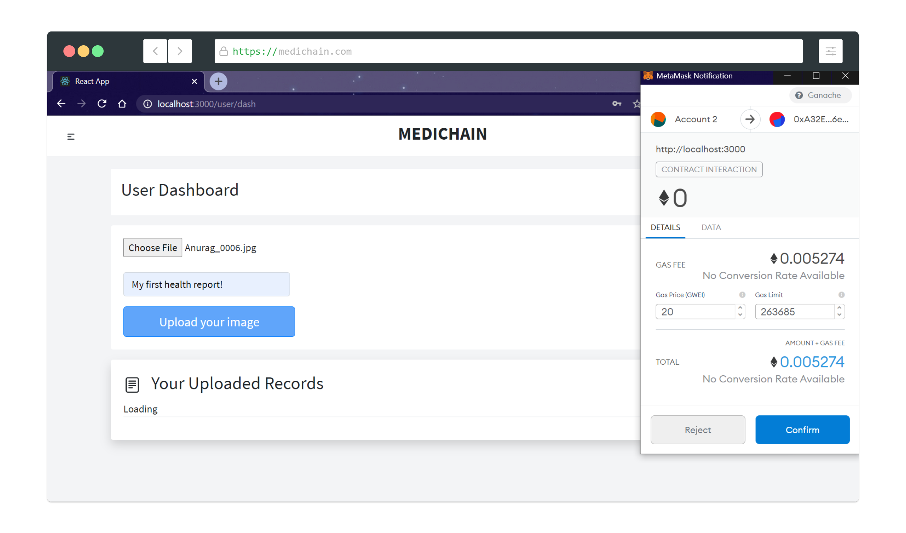

## 4. User Dashboard

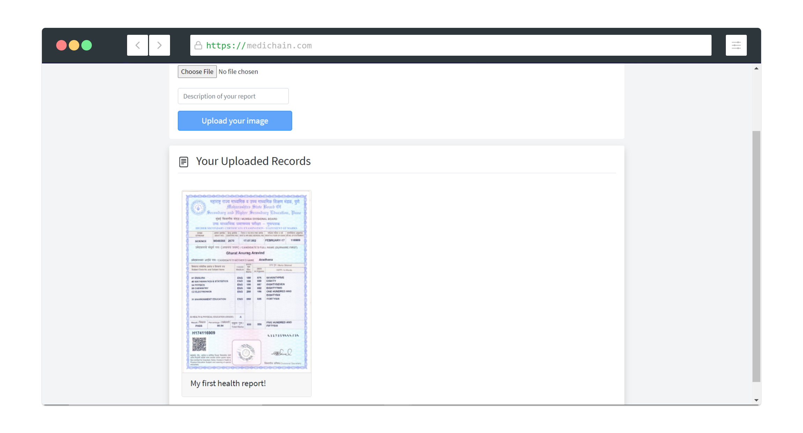

## 5. List of Doctors

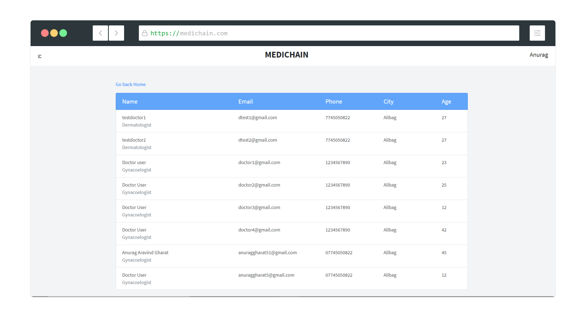

## 6. User Profile

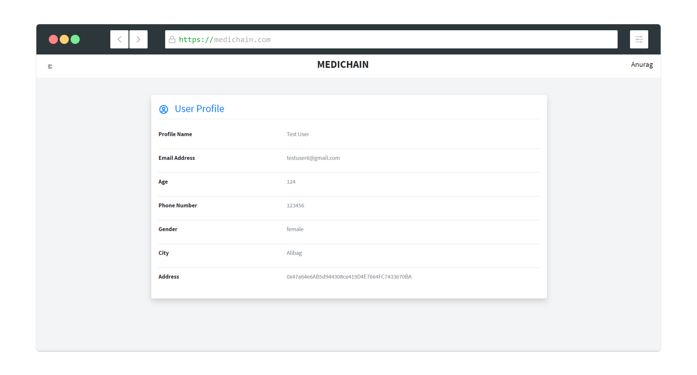

## 7. Doctor Signup

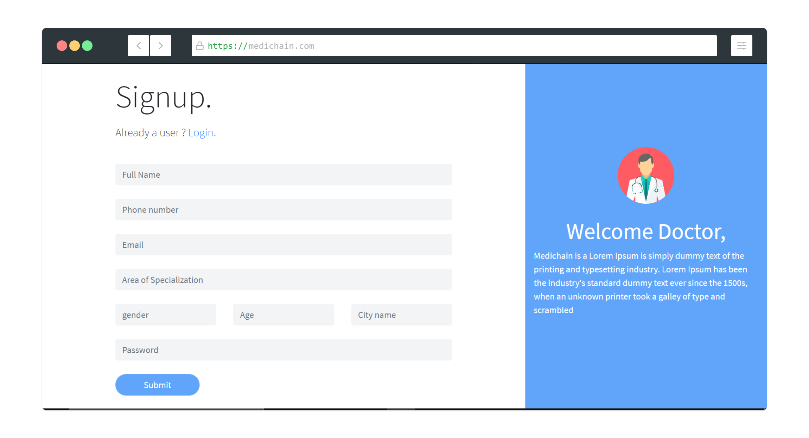

## 8. Doctor Profile

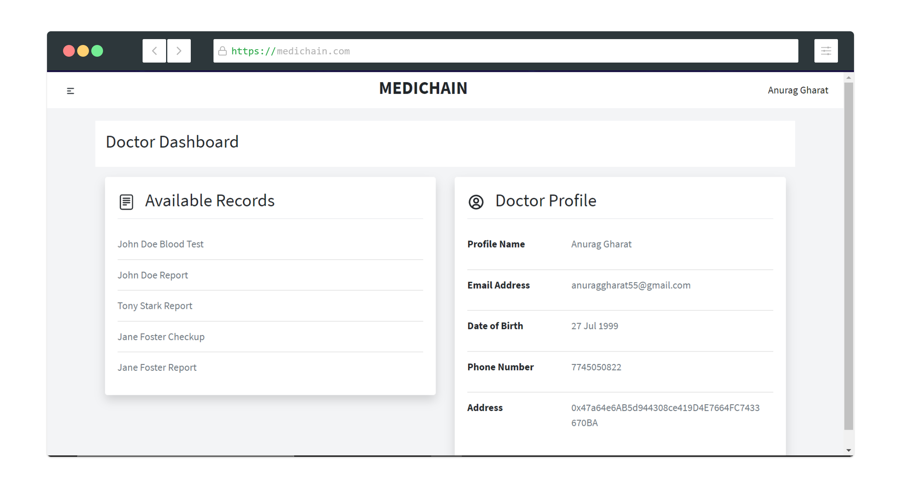

### Brief working of the Proposed system.

- The Patient User will need a Ethereum account using Metamask plugin to be a part of the Blockchain.
- Once done he can visit the signup page and enter his personal details and credentials. After passing all the authentication checks he must login into his profile.
- Once logged in he can upload his records in image format to the blockchain. For uploading he must pay some ethers in order to complete the transaction.
- There are several sub pages created in user profile such as:
    
    Dashboard : The dashboard will display all the records the user has uploaded till now. 
    
    Profile page : This page shows all his personal details mentioned during signup process.
    
    Doctors Page : This page displays a list of all doctors who are a part of Blockchain. Here he can grant access to anyone after checking his profile.
    
    Requests Page : This page has all the requests sent by doctors to access his medical records. He can either delete these requests or accept them.
    
    Access List Page : This page mentions the list of all the Doctors that have access to view his records. He can revoke their access from here.
    
- When the user uploads his record, the record is sent to IPFS network which in turn returns us hash of the uploaded asset. We store this hash on the blockchain along with other necessary details.
- When the user grants access permission to any doctor, using smart contracts we save the doctors address on blockchain in form of mapping and mine a new block.
- The doctor needs to go through the same procedure of signup and then signin, once he enters in his profile he will be able to see the records if the user has granted him the permission. Else the dashboard will be empty.
- He can go to users page and find the user whose records he wants to check. He can request a grant access from the user, his request will go through the server and will be sent to the specific users dashboard.
- If he has access he can view the records from his dashboard.
